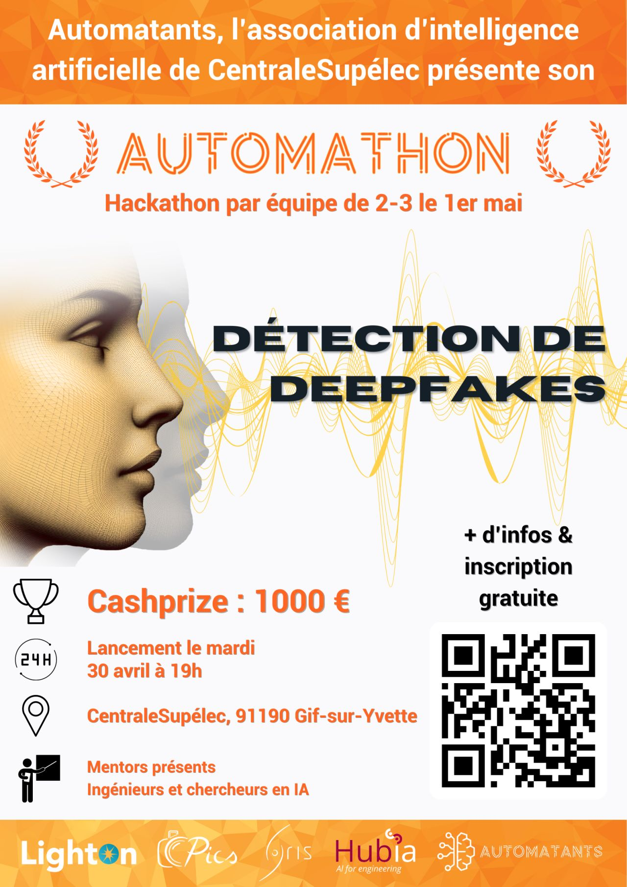
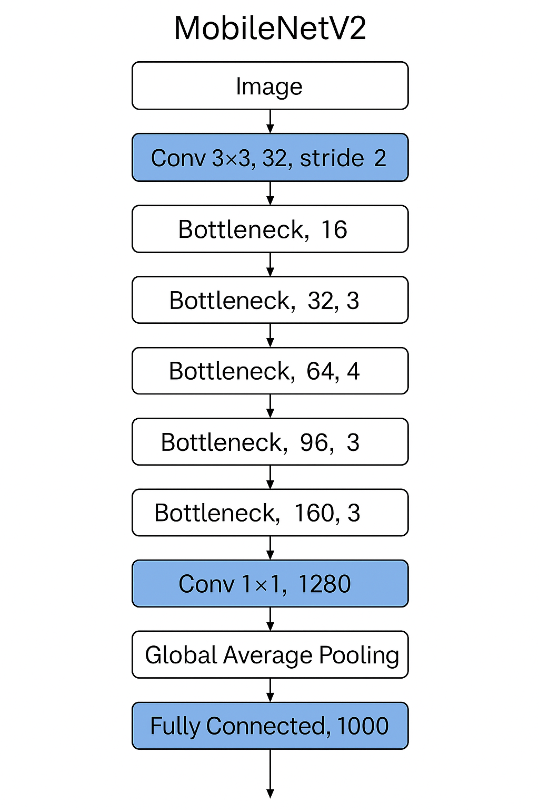
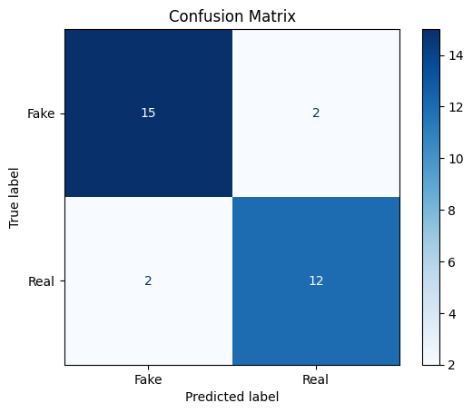

# **Deepfake Recognition Project**

  


---

## **Overview**

This project aims to detect deepfake videos using video data from the **Centrale Supélec Deepfake Recognition Hackathon 2024** dataset, available on Kaggle. The solution leverages **PyTorch** for video classification and focuses on preprocessing, training, and evaluating a deep learning model.

---

## **Features**

- **Preprocessing**:  
  - Crops faces from video frames using **MTCNN (Multi-Task Cascaded Convolutional Networks)**.  
  - Resizes cropped frames to 224x224 pixels for model input.  

- **Model Architecture**:  
  - Uses a **pretrained MobileNetV2** model for binary classification (real vs. fake).  
  - Modifies the classifier layer for deepfake detection.  

- **Training and Optimization**:  
  - Implements a training loop with **Adam optimizer** and **CrossEntropy loss**.  
  - Balances the dataset to address class imbalance.  

- **Evaluation**:  
  - Generates a **confusion matrix** to visualize model performance.  
  - Computes accuracy on the validation set.

---

## **Dataset**

  

- **Source**: [Kaggle Deepfake Detection Challenge](https://www.kaggle.com/competitions/deepfake-detection-challenge/data).  
- **Structure**: Videos labeled as either "real" or "fake" in `metadata.json`.  
- **Preprocessing**: Cropped face videos are stored in the `cropped_faces` directory.

---

## **Pipeline**

1. **Preprocessing**:  
   - Detect faces in video frames using **MTCNN**.  
   - Crop and resize faces.  
   - Save cropped faces as new videos.

2. **Dataset Preparation**:  
   - Parse `metadata.json` to extract labels.  
   - Balance the dataset (real vs. fake).  
   - Split into training and validation sets.

3. **Model Training**:  
   - Use **MobileNetV2** for binary classification.  
   - Train for 10 epochs with logging of loss and accuracy.

4. **Evaluation**:  
   - Compute predictions on the validation set.  
   - Generate a confusion matrix.

---

## **Model Architecture**

  

- **Base Model**: MobileNetV2 pretrained on ImageNet.  
- **Classifier**: Fully connected layer with two outputs (real or fake).  
- **Optimizer**: Adam optimizer with a learning rate of 0.001.  
- **Loss Function**: CrossEntropyLoss.

---

## **Results**

### **Confusion Matrix**
  
*Add the confusion matrix generated during evaluation.*

- **Accuracy**: Achieved 87% accuracy on the validation set.  

---

## **Installation**


1. Clone the repository:
   ```bash
   git clone https://github.com/your-username/deepfake-recognition.git
   cd deepfake-recognition

### **Requirements**
- Install all required dependencies from the `requirements.txt` file:
   ```bash
   pip install -r requirements.txt

Deepfake-recognition/
├── cropped_faces/                # Directory for cropped face videos
├── deepfake-detection-challenge/ # Dataset directory
├── models/                       # Saved model weights
├── scripts/                      # Python scripts for preprocessing, training, and evaluation
├── [README.md](http://_vscodecontentref_/0)                     # Project documentation
├── [requirements.txt](http://_vscodecontentref_/1)              # Python dependencies
├── [metadata.json](http://_vscodecontentref_/2)                 # Metadata for video labels
├── [Code.ipynb](http://_vscodecontentref_/3)                    # Main notebook for the project
└── test_Code.ipynb               # Test notebook